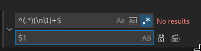

# vscode

#### Remover linhas duplicadas

1. CTRL + F
2. Mudar para modo de substituição \(Replace mode\)
3. Ativar Regex na busca
4. No campo buscar, colocar a regex: `^(.*)(\n\1)+$`
5. Em substituir com, colocar: `$1`
6. Clicar em: Substituir todas

Fonte: [https://toniguga.it/blog/2020/03/17/how-to-remove-duplicate-lines-in-visual-studio-code/](https://toniguga.it/blog/2020/03/17/how-to-remove-duplicate-lines-in-visual-studio-code/)

